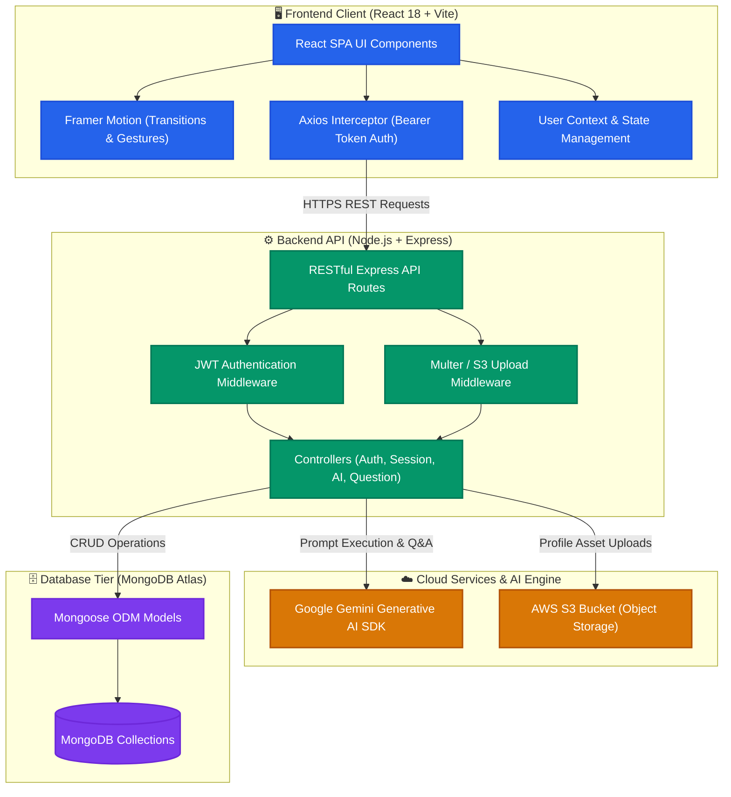
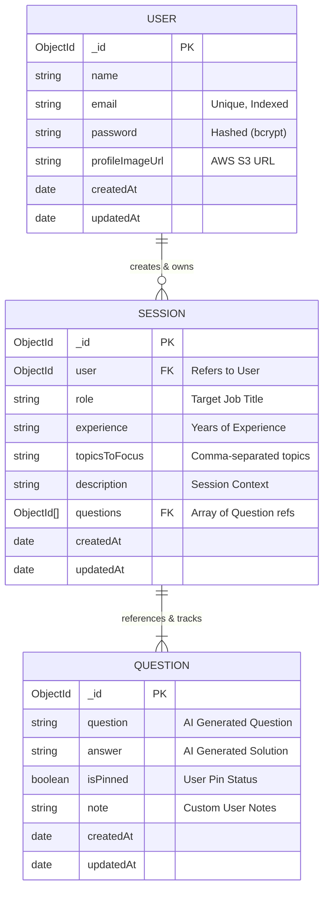

<div align="center">

# PrepInt - AI Powered Interview Preparation Platform

**Ace your next technical interview with AI-curated role-specific questions, instant concept breakdowns, and smart session tracking.**

[](https://react.dev/)
[](https://vitejs.dev/)
[](https://tailwindcss.com/)
[](https://www.framer.com/motion/)
[](https://nodejs.org/)
[](https://expressjs.com/)
[](https://www.mongodb.com/)
[](https://deepmind.google/technologies/gemini/)
[](https://aws.amazon.com/s3/)
[](https://github.com/alokprasad573/AI-Powered-Interview-Preparation-Platform/actions/workflows/frontend-ci.yml)
[](https://github.com/alokprasad573/AI-Powered-Interview-Preparation-Platform/actions/workflows/backend-ci.yml)
[](https://vercel.com/)

<br />


</div>

---

## 📌 Executive Summary
**PrepInt** is an end-to-end full-stack web platform designed to streamline tech interview preparation. Leveraging **Google Gemini AI**, it delivers dynamic, personalized interview simulations based on target roles, experience levels, and focus topics with automated concept explanations and rich markdown visualization.

---

## 🌟 Key Features

- 🎯 **Targeted AI Question Generation** — Dynamically crafts interview questions customized by job designation, domain, years of experience, and niche focus topics.
- 💡 **Instant Deep-Dive Concept Explanations** — On-demand AI breakdowns of complex architectural and algorithmic concepts directly inside a responsive side-drawer.
- 📊 **Intelligent Session Command Center** — Seamlessly create, organize, review, expand, or delete preparation sessions with live metrics (total tracks, questions mastered).
- 🔍 **Real-Time Role & Topic Filtering** — Instant keyword search across preparation tracks to quickly locate specific tech stacks or questions.
- 📌 **Question Pinning & Notes** — Bookmark priority questions and attach personalized preparation notes to track revision progress.
- ⚡ **Zero-Latency UI & Motion** — Fluid micro-interactions, responsive side-drawers, skeletons, and loading indicators powered by Framer Motion.
- 📋 **Interactive Code Previews & Markdown Rendering** — Syntax-highlighted code blocks, copy-to-clipboard functionality, and structured markdown parsing.
- 🔐 **JWT-Based Authentication & Cloud Storage** — Secure user sign-up/login sessions with profile photo storage powered by **AWS S3**.

---

## 🏛️ System Architecture



---

## 🗄️ Database Design (Schema ERD)



---

## 💻 Tech Stack

### **Frontend**
| Technology | Purpose |
| :--- | :--- |
| **React 18** | Component-driven declarative UI architecture |
| **Vite** | Next-generation ultra-fast frontend build tooling |
| **Tailwind CSS** | Utility-first responsive styling and design system |
| **Framer Motion** | Physics-based animations and layout transitions |
| **Axios** | Promised-based HTTP client with centralized interceptors |
| **React Router DOM** | Client-side routing and protected routes |
| **markdown-to-jsx** | Real-time markdown and syntax rendering for AI solutions |
| **React Icons (Lu)** | Clean, lightweight icon suite |

### **Backend & Cloud**
| Technology | Purpose |
| :--- | :--- |
| **Node.js 18+** | High-performance asynchronous JavaScript runtime |
| **Express.js** | Scalable REST API architecture and routing |
| **MongoDB & Mongoose** | NoSQL document database with strict schema validation |
| **Google Gemini AI SDK** | Advanced LLM prompts for role-specific interview generation |
| **AWS S3** | Cloud object storage for user media and profile assets |
| **JWT & Bcrypt** | Secure stateless authentication and password hashing |
| **Multer** | Multipart form-data handling for file uploads |

---

## 📂 Project Structure

```
PrepInt/
├── .gitignore
├── README.md
├── client/                     # Frontend SPA (React 18 + Vite + Tailwind CSS)
│   ├── public/                 # Static public assets (icons, SVGs, favicon)
│   └── src/                    # Core frontend application source
│       ├── assets/             # Images, vector graphics, and brand assets
│       ├── components/         # Reusable UI component library
│       │   ├── cards/          # Profile display and interview session summary cards
│       │   ├── inputs/         # Styled inputs and interactive photo upload selector
│       │   ├── layouts/        # Application layout wrapper and top navigation bar
│       │   └── loader/         # Loading indicators (skeleton loaders & spinners)
│       ├── context/            # React Context providers (global user & session state)
│       ├── pages/              # Primary view pages and routing
│       │   ├── Auth/           # Authentication interfaces (Login and Registration)
│       │   ├── Home/           # User Dashboard and session creation modal forms
│       │   └── InterviewPrep/  # Core preparation hub (Question feed, AI drawer, code view)
│       └── utils/              # Axios instance, API endpoints, and utility functions
│
└── server/                     # Backend REST API (Node.js + Express + MongoDB)
    ├── config/                 # Database initialization and connection logic
    ├── controllers/            # Controller layer containing core business logic (AI, Auth, Session)
    ├── middlewares/            # Middleware pipeline (JWT authentication & file upload handlers)
    ├── models/                 # Mongoose database models & schema definitions
    ├── routes/                 # Express REST endpoint route definitions
    └── utils/                  # Gemini AI prompts and helper utilities
```

---

## 💼 Resume & Engineering Highlights

> **Core Competencies Demonstrated:** Full-Stack Architecture • Generative AI Orchestration • Cloud Infrastructure • Performance & State Optimization

### 🧠 Generative AI System Design
- **Deterministic Prompt Engineering:** Architected robust, schema-enforced prompt pipelines for **Google Gemini 1.5**, guaranteeing zero-parse-error JSON responses for dynamic question curation and technical breakdowns.
- **Fail-Safe Response Parsing:** Integrated multi-tier fallback parsing and sanitizer routines to defend against malformed LLM outputs and markdown code-block wrapping anomalies.

### ⚡ Frontend Performance & UX Engineering
- **Zero-Jank Side-Drawer Architecture:** Refactored the interactive concept explanation drawer to eliminate animation layout shifts, achieving instant, non-blocking rendering during intense study sessions.
- **Optimistic State & Asynchronous Feedback:** Engineered responsive user feedback patterns utilizing **Framer Motion**, skeleton placeholders, and synchronized loading spinners to mask network latencies.
- **Smart Markdown & Syntax Highlighting:** Integrated rich markdown rendering with automated copy-to-clipboard functionality and code-block syntax formatting for a developer-first interview preparation flow.

### 🛡️ Enterprise-Grade Security & Cloud Storage
- **Stateless Authentication:** Enforced JWT authentication with HTTP bearer tokens, bcrypt salt-hashing for passwords, and protected route middlewares across all private API surfaces.
- **Scalable Media Pipelines:** Integrated **AWS S3** via Multer memory buffering, offloading static file storage and enabling high-availability asset delivery.
- **Defensive API Architecture:** Standardized RESTful endpoints with centralized error handling, CORS security policies, and guarded database cascades on session deletion.

---

## 🔄 CI/CD

GitHub Actions is used for continuous integration, and Vercel handles deployment.

- **Frontend CI Pipeline (`.github/workflows/frontend-ci.yml`):** Triggers on pushes and PRs touching `client/**` to run dependency installation, ESLint checks, and production build verification (`npm run build`) on Node 20.
- **Backend CI Pipeline (`.github/workflows/backend-ci.yml`):** Triggers on pushes and PRs touching `server/**` to validate dependencies and verify server syntax integrity (`node --check index.js`).
- **Continuous Deployment:** Seamlessly integrated with **Vercel** for instant pull request preview deployments and zero-downtime production rollouts.

---

## ⚡ Getting Started

### 1. Prerequisites
- **Node.js** (v18.x or later)
- **MongoDB** (Local instance or MongoDB Atlas cluster)
- **Google Gemini API Key**
- **AWS S3 Bucket & IAM Credentials** (for asset uploads)

### 2. Installation & Setup

```bash
# Clone the repository
git clone https://github.com/alokprasad573/AI-Powered-Interview-Preparation-Platform.git
cd AI-Powered-Interview-Preparation-Platform

# Setup Backend
cd server
npm install

# Setup Frontend
cd ../client
npm install
```

### 3. Environment Configuration

Create a `.env` file in the `server/` directory:
```env
MONGO_URI=your_mongodb_connection_string
JWT_SECRET=your_jwt_secret_key
GEMINI_API_KEY=your_gemini_api_key
AWS_ACCESS_KEY_ID=your_aws_access_key
AWS_SECRET_ACCESS_KEY=your_aws_secret_key
AWS_BUCKET_NAME=your_s3_bucket_name
AWS_REGION=your_aws_region
```

Create a `.env` file in the `client/` directory:
```env
VITE_BACKEND_URL=http://localhost:8000
```

### 4. Running the Application

```bash
# Terminal 1: Launch Backend
cd server
npm run dev

# Terminal 2: Launch Frontend
cd client
npm run dev
```

Visit `http://localhost:5173` in your browser.

---

<div align="center">
  <sub>Built with ❤️ by a passionate Software Engineer. Star ⭐ this repository if you find it helpful!</sub>
</div>

